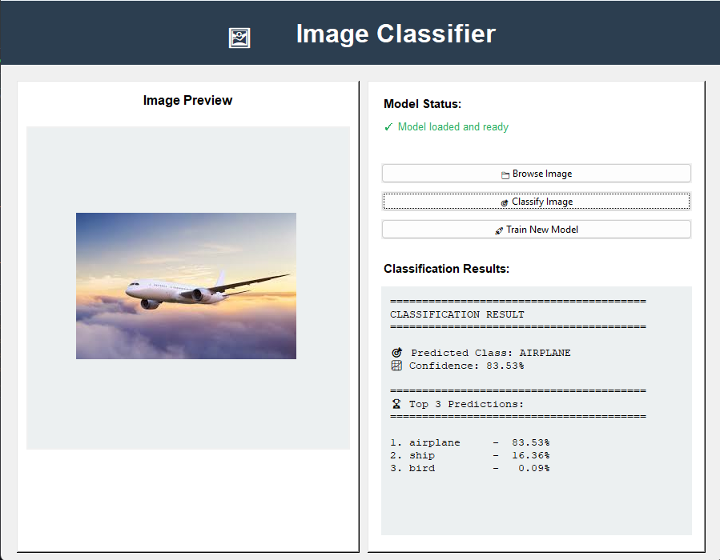

# 🖼️ Deep Learning Image Classifier

A professional desktop-based **Image Classification System** built using **TensorFlow, OpenCV, and Tkinter**.  
The application trains a Convolutional Neural Network (CNN) on the **CIFAR-10 dataset** and allows users to classify custom images through an interactive graphical interface.

---

# 📌 Overview



This project combines:

- Computer Vision
- Deep Learning
- Desktop GUI Development
- Image Processing

to create a complete end-to-end image classification application.

The system uses:
- **OpenCV** for image preprocessing
- **TensorFlow/Keras** for deep learning
- **Tkinter** for GUI development

---

# 🚀 Features

## ✅ Deep Learning Classification
- CNN-based image classification
- Trained on CIFAR-10 dataset
- Multi-class prediction support

## ✅ OpenCV Image Processing
- Image loading and validation
- RGB color conversion
- Image resizing
- Image normalization

## ✅ Interactive GUI
- User-friendly interface
- Image preview panel
- Real-time prediction display
- Training progress tracking

## ✅ Model Management
- Save trained models
- Load existing models
- Automatic model detection

## ✅ Training Optimization
- Data augmentation
- Batch normalization
- Dropout regularization
- Early stopping
- Learning rate scheduling

---

# 🧠 Supported Classes

| Class | Description |
|---|---|
| ✈️ Airplane | Aircraft images |
| 🚗 Automobile | Cars and vehicles |
| 🐦 Bird | Bird species |
| 🐱 Cat | Domestic cats |
| 🦌 Deer | Deer animals |
| 🐶 Dog | Dog breeds |
| 🐸 Frog | Frog species |
| 🐴 Horse | Horses |
| 🚢 Ship | Watercraft |
| 🚚 Truck | Transport trucks |

---

# 🏗️ System Architecture

```text
User Image
    ↓
OpenCV Preprocessing
    ↓
Image Normalization
    ↓
CNN Model Prediction
    ↓
Classification Results
    ↓
GUI Display
```

---

# 🛠️ Technologies Used

| Technology | Purpose |
|---|---|
| Python | Core Programming |
| TensorFlow / Keras | Deep Learning Framework |
| OpenCV | Image Processing |
| Tkinter | GUI Development |
| NumPy | Numerical Operations |
| Pillow (PIL) | Image Rendering |
| Matplotlib | Visualization |

---

# 📂 Project Structure

```bash
DeepLearning-ImageClassifier/
│
├── main.py
├── cifar10_model.h5
├── README.md
├── requirements.txt
└── screenshots/
    └── app_preview.png
```

---

# ⚙️ Installation

## 1️⃣ Clone the Repository

```bash
git clone https://github.com/your-username/DeepLearning-ImageClassifier.git
```

```bash
cd DeepLearning-ImageClassifier
```

---

## 2️⃣ Install Dependencies

```bash
pip install -r requirements.txt
```

---

# 📦 Requirements

Create a `requirements.txt` file:

```txt
tensorflow
opencv-python
numpy
matplotlib
pillow
```

---

# ▶️ Running the Application

Launch the GUI application:

```bash
python main.py
```

---

# 🏋️ Model Training

If no trained model is found:

1. Open the application
2. Click **"Train New Model"**
3. Wait for training to complete
4. The model will automatically save as:

```bash
cifar10_model.h5
```

---

# 🧪 Image Classification Workflow

## Step 1 — Load Image
Users select an image from their local system.

## Step 2 — OpenCV Preprocessing
The image undergoes:
- Reading
- Color conversion
- Resizing
- Normalization

## Step 3 — CNN Prediction
The trained CNN predicts:
- Main class
- Confidence score
- Top 3 probabilities

## Step 4 — Result Display
Results are displayed inside the GUI.

---

# 🔍 OpenCV Integration

The project uses OpenCV for preprocessing operations:

```python
cv2.imread()
cv2.cvtColor()
cv2.resize()
```

### Processing Pipeline

```text
Image → RGB Conversion → Resize → Normalize → CNN
```

---

# 🧠 CNN Architecture

The model includes:

- Multiple Convolutional Layers
- Batch Normalization
- Max Pooling
- Dropout Layers
- Fully Connected Dense Layers
- Softmax Output Layer

### Training Enhancements

- Data Augmentation
- EarlyStopping
- ReduceLROnPlateau

---

# 📈 Performance

| Metric | Value |
|---|---|
| Dataset | CIFAR-10 |
| Input Size | 32×32 |
| Classes | 10 |
| Expected Accuracy | 75% – 85% |

---

# 🖥️ GUI Features

- Image Preview Panel
- Classification Results Panel
- Model Status Indicator
- Training Progress Bar
- Interactive Controls

---

